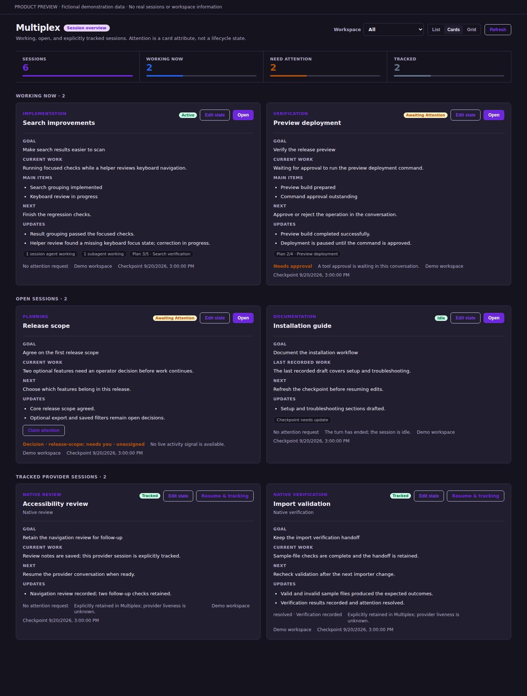

# Multiplex

**Your agents, their work, the bigger picture.**

Multiplex brings sessions across agents, models, and providers into one
[KiroCrew](https://github.com/kirodotdev/KiroCrew) overview. See who is working on
what, what needs your attention, and what comes next—without opening every
conversation to hunt for a status update or summary.

When agents work together, their recorded goals, updates, and next actions sit
side by side. Follow handoffs, spot recorded blockers, and choose where to step
in. Open a conversation when you want to act; keep the overview for following
the whole team.



## When to use it

- **Several sessions in flight:** scan recorded work across models and providers
  before deciding which conversation needs a closer look.
- **Agents working together:** compare their updates and next actions to follow
  a recorded handoff from implementation to review or verification.
- **A decision waiting on you:** read the attention request on the card, then
  open its conversation with the context already in view.
- **Picking up after a break:** return to a saved checkpoint instead of searching
  the conversation for where you left off.
- **Native work to revisit:** keep a supported provider session visible and use
  its resume details when you are ready to continue.

Start with the [five-minute walkthrough](docs/first-overview.md).

## What it does

- Coordinates KiroCrew sessions across agents, models, and providers alongside
  supported native Claude, Codex, and Antigravity sessions.
- Shows an at-a-glance operational summary and list, cards, or compact grid
  views of known work.
- Separates a session's catalog presence, execution state, and attention state.
- Records concise, bounded checkpoints: goal, current work, next action, main
  items, and evidence-backed updates.
- Keeps provider-native observations distinct from KiroCrew-owned dashboard
  slots. Native sessions can be explicitly retained or moved to history.
- Projects workflow status as read-only cards and opens the existing KiroCrew
  screen for the detail.

## Install

```bash
git clone https://github.com/Premshay/kirocrew-multiplex.git multiplex
kirocrew app install ./multiplex
kirocrew app enable multiplex
```

The app uses KiroCrew app storage and its existing session APIs. Its Python
backend executes with gateway privileges and requires explicit app trust before
enablement. For a local checkout, add `multiplex` to both `agent.apps_trusted`
and `agent.apps_trusted_local` in KiroCrew configuration, preserving existing
entries. These app-specific grants avoid enabling every third-party app through
`agent.apps_allow_third_party`. Review the checkout before granting trust.

Native-session discovery uses KiroCrew's declared workspaces. Optional provider
hooks add lifecycle signals and checkpoints for supported native clients.

## Data boundary

Multiplex reads dashboard slot metadata, explicit checkpoint records, workflow
status, and—only inside the workspace roots KiroCrew has already declared—a
bounded head and tail of native provider transcript metadata. It stores concise
operator-authored checkpoint records and explicit native-session retention
choices in its own KiroCrew app storage.

It has no external analytics or telemetry destination. The UI and optional hooks
communicate with the configured KiroCrew gateway; a remote gateway receives
those requests over the network. It does not create a second conversation, infer
work from a full transcript, or claim that an observed native transcript is a
live session. Removing the app source does not remove stored app data; use the
KiroCrew app data controls when an operator needs to clear it.

## Checkpoints and optional provider hooks

Use the card's **Edit state** control to record a goal, current work, next action,
and updates. Hosts that provide a session-bound `session_checkpoint` tool can
also publish agent-authored records; stock KiroCrew 0.8.0 does not include that
tool. Installing Multiplex alone does not add it.

The return-to-loop control is available only when the host registers its
return-handoff endpoint and the session has an active loop. Stock KiroCrew
0.8.0 does not provide that endpoint. Ordinary checkpoint editing and native
resume-copy controls do not require it.

Optional scripts in `scripts/` let supported native clients publish lifecycle
events and checkpoints. They use the installed app's credential exchange and
default to `http://127.0.0.1:5476`; override it with `MULTIPLEX_GATEWAY` when
the gateway is elsewhere.

```bash
# Inspect the proposed hook configuration before changing a client setting.
python3 scripts/configure_multiplex_claude_hooks.py
python3 scripts/configure_multiplex_codex_hooks.py

# Apply only after reviewing the proposed configuration.
python3 scripts/configure_multiplex_claude_hooks.py --apply
python3 scripts/configure_multiplex_codex_hooks.py --apply
```

The hook commands resolve beside their installer, so relocating the checkout
does not embed a machine-specific path. Hook installation is opt-in and does
not alter existing settings until `--apply` is supplied.

## Updating

UI-only updates are served after the dashboard reloads. After updating an
external app's backend, disable and enable the app, then verify a changed route
response before treating the update as loaded:

```bash
kirocrew app disable multiplex
kirocrew app enable multiplex
```

## Tests

The route tests import `aiohttp` and `kiro_crew`, so run them with KiroCrew's
Python environment:

```bash
/path/to/KiroCrew/.venv/bin/python -m pytest tests -q
node --check ui/index.mjs
```

## Release status

Version `0.1.1` improves the store copy and adds a usage walkthrough; app behavior
is unchanged from the initial standalone release. The repository
includes an opaque icon, hero artwork, and a browser capture of the shipped UI
with explicitly fictional data. The capture uses an isolated preview with SDK
stubs; it is not evidence of a working dashboard installation.

Stock KiroCrew 0.8.0 acceptance covers installation, backend registration,
sidebar navigation, all three layouts, and checkpoint saving across a reload.
See [release checks](RELEASE.md) for verification scope.

## License

[MIT](LICENSE)
